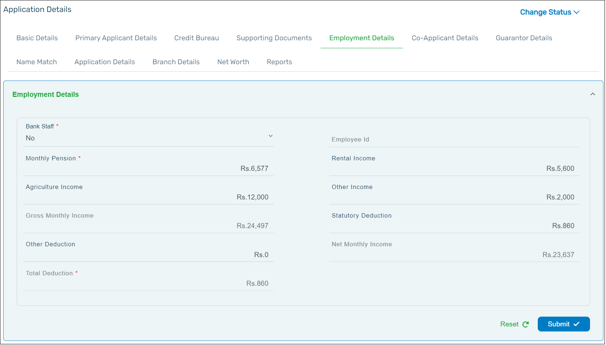

In the Employment Details tab, you can fill in the **Employment** and the **Income** details of the applicant. Click **Submit** after all the fields are filled.

:::info

- Make sure to fill all fields that are marked with a red asterisk (\*) as these are mandatory fields to process the application.
- The applicant can add additional income such as **Rental Income**, **Agricultural Income** and Other **Income**, if they are applicable.
- If the applicant is a bank employee, it is mandatory to add the Employee ID (PF ID).
  :::

  After you update the employment details, click **Submit** for it to get saved.
