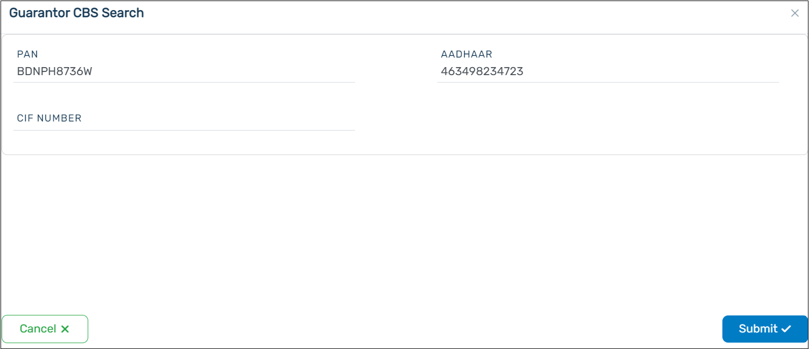
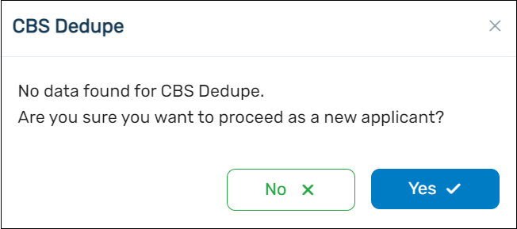
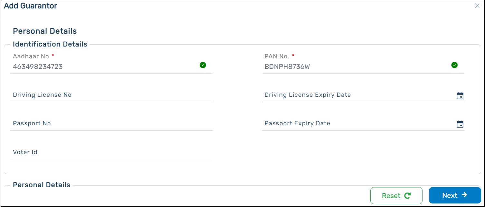

Add the details of the **Guarantors** to the loan application in this section. If there are no guarantors, you can skip this section.

You can add the details of the guarantors in the fields available. The system will match the details entered with the details available in CBS. If the details are available in CBS, the guarantor details can be auto populated.

    

If the details are not available in CBS, you would get a pop-up as shown below. Click Yes to proceed.

    

A pop-up will appear asking you to provide the details. You can add the personal details, address details and the family member details of the guarantor.

:::info

- A maximum of **3 co-applicants** can be added to the pensioner loan application.
- The addition of a guarantor to the pensionerloan application requires the information of the individual like the entries made for the primary applicant.
- The CIF Number is not mandatory for the Pensioner Loan product.
  :::

  
