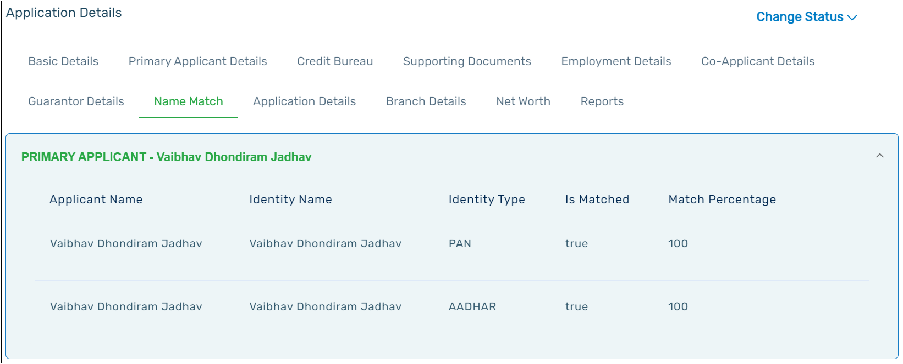

The information available in this tab is auto generated. The system will perform the check of the name of the applicant along with the name present in the Aadhaar and PAN.  
If the names of the applicant match, **‘True’** will be displayed in the Is **Matched** column. The name match percentage is also displayed in the Match Percentage column.

