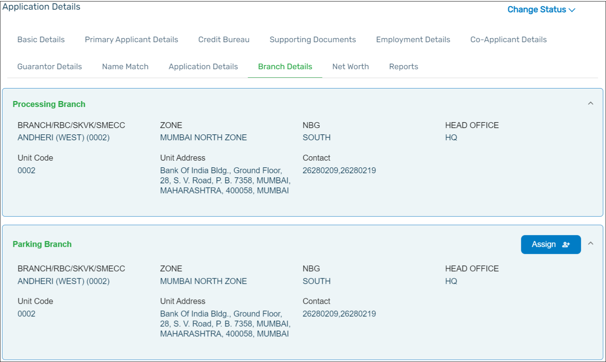

You can view the information related to the **Branch** where the application is being processed and the parking branch. Click the **Branch Details** tab to view the information.

The details of the branch where the application is being processed is shown as the Processing Branch. The details of the branch where the loan account would get opened is shown as the Parking Branch.

If you require to assign the application to a different Parking branch, click **Assign** button. Select the required branch in the list of dropdown that is available and Click the **Submit** button.

