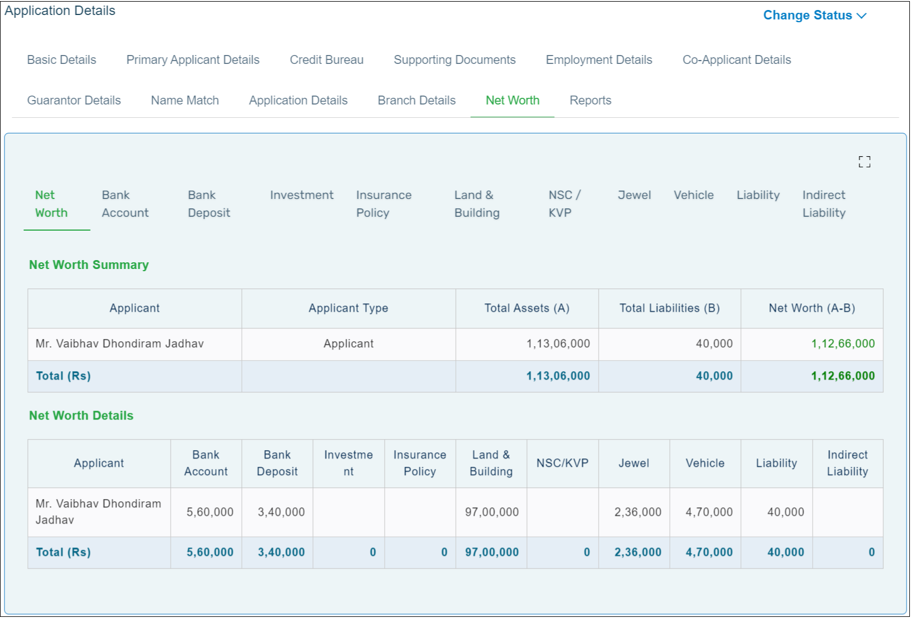

Click the **Net Worth** tab. You can enter the details related to the customer’s liabilities and assets in the different tabs that are available. Click **Add icon** for the pop-up to appear and enter the necessary details.  
Once you complete adding the details, click on **Net Worth** tab to view the summarized net worth of the customer.

