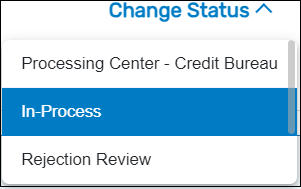
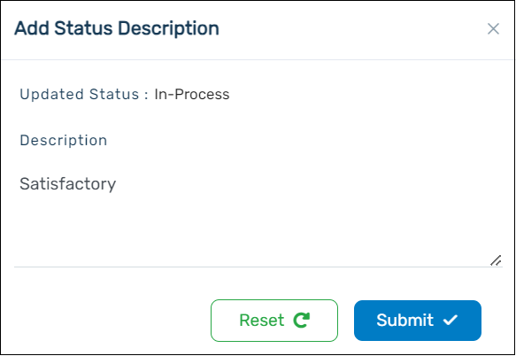

You can move the application to the next status, click on the Change Status button that is present on the right-hand side of the screen and click the required status.

If you require the validation to be made by the processing center (RBC), click Processing Center - Credit Bureau.

Add your comments in the pop-up that appears and click **Submit**.

:::info

- If the customer requests a loan of higher value, a validation can be done at the processing center (RBC).
- For more information related to the RBC validation, please read the section Processing Center (RBC).
  :::
