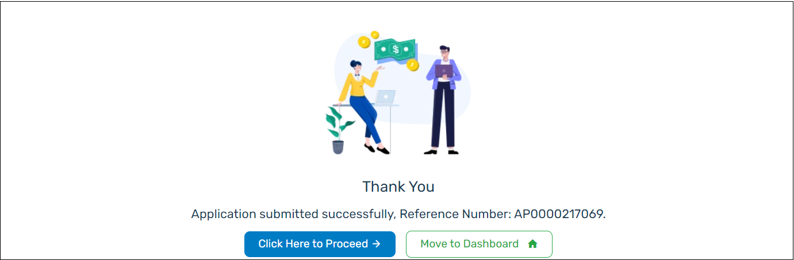

Once you have filled all the required details, click **Submit** at the end of the **Primary Applicant Documents** page. The application is successfully submitted, and a unique reference number **(APXXXXXXXXXX)** will be created for the application. The unique reference number for the application is displayed on the screen. Using this application reference number, the branch officer can track the application and complete it.

:::info

    - The **Click Here to Proceed** button will review the recently submitted application and the **Click Move to Dashboard** button to return to the dashboard.

:::
