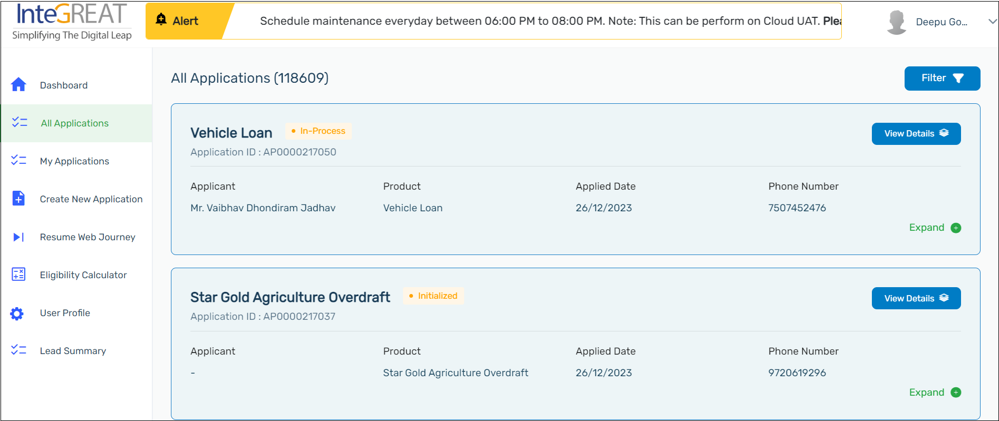
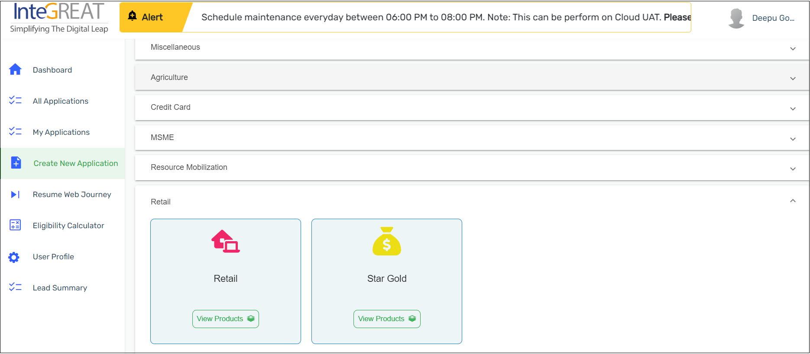
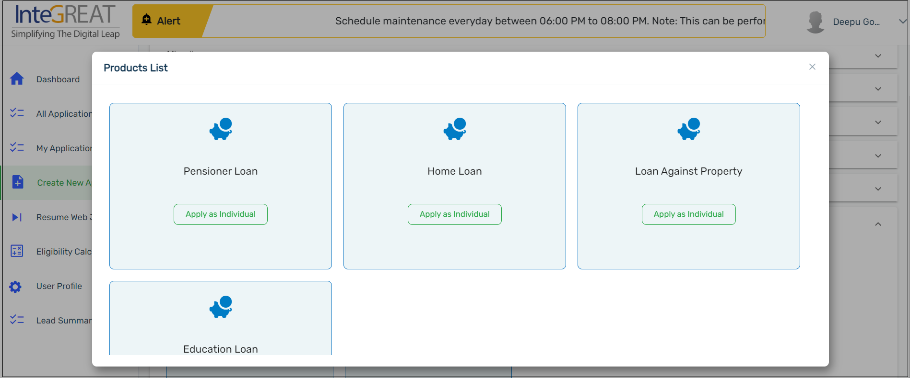
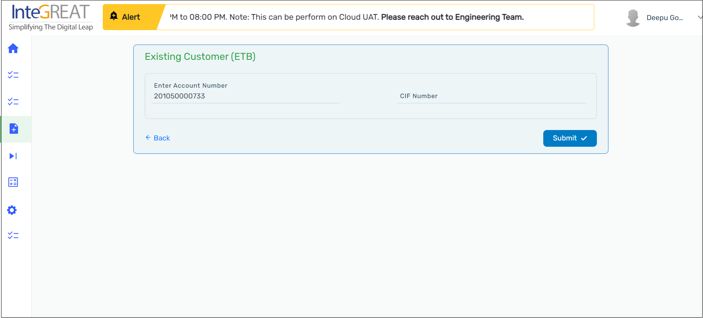
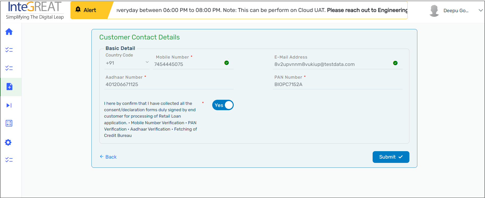

1. Click **Create New Application**. Click View Products under the Retail dropdown.

   

2. Click **Apply as Individual** under Pensioner Loan to start a loan application.

   

3. Savings/Current Account Number:
   Add the details of the **Account Number** of the savings account or the current account of the customer. Based upon the account number that is provided, the system will fetch the details that are readily available. The **E-Mail Address, Mobile Number, Aadhaar Number** and the **PAN Number** will be pre-populated if the records are previously available with the bank. You can confirm the details that are pre-populated.

   

   Based upon the customer’s details available with the bank, the fields will be auto populated in the pensioner loan application as you progress.

   :::info

   - Only customers who are already associated with the Bank of India can avail the Pensioner Loan.
     :::

4. Customer Contact Details:
   Confirm the **Customer Contact Details** that are auto populated such as the:

   - Mobile Number
   - E-mail Address
   - Aadhaar Number
   - PAN Number

   

   To verify the **Mobile Number** or the **E-Mail Address**, click **Verify** next to the respective field. Enter the verification code received on your phone or E-Mail in the verification pop-up window and click verify. After the Mobile Number or the E-Mail Address is verified, a green tick will be visible next to it.

   Provide your confirmation for collecting the consent/declaration forms by a click on the button. Switching the toggle button to right hand side indicates that the consent is provided.

   Click on the **Submit** button after you add all the details.

   

   :::info

   - Make sure you fill all the mandatory fields that are marked with a red asterisk (\*).
   - **PAN Number** must be inserted in the AAAPA9999A format (The fourth letter of the PAN must be ‘P’. The first five letters and the tenth letter must be alphabetic. Sixth to ninth are to be numeric digits).
   - Maximum number of attempts to verify the mobile number is three.
   - The verification code for the mobile number is only valid for 180 seconds.
   - The **E-Mail address** is not mandatory to be verified.
   - The verification of Mobile Number and **E-Mail address** is mandatory.
     :::
