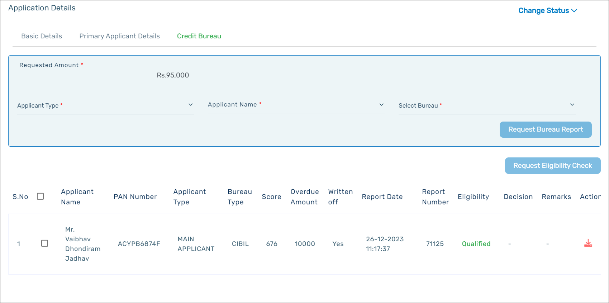

In the **Credit Bureau** tab, enter the amount of loan requested by the applicant. Select the applicant details, and then select the credit bureau agency for the credit bureau report.

Click **Request Bureau** Report to initiate the report request with the credit bureau agency. The credit bureau data will be populated automatically. To download the report, click the download icon in the Actions column of the table.

To check the eligibility of the applicant, select the credit report, and then click **Request Eligibility** Check. BRE call will be initiated by the system. The eligibility check will be based on the policies that are framed. Based on the eligibility check and the credit report, the eligibility of the applicant will be displayed next to the **Request Eligibility** Check button as **Qualified** or **Not Qualified**.

:::info

    - The credit bureau scores will be populated based upon the constitution of the loan application.
    - It is mandatory for the user to complete the eligibility check of the applicant (main applicant, co-applicant and the guarantor).
    - If the user tries to change the status of the application without the eligibility check being done, an error message will pop up.

:::

