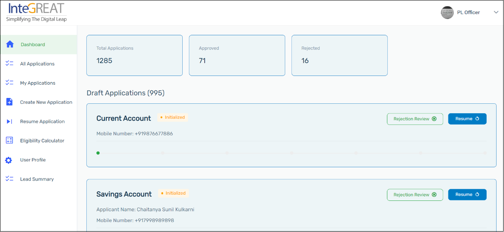
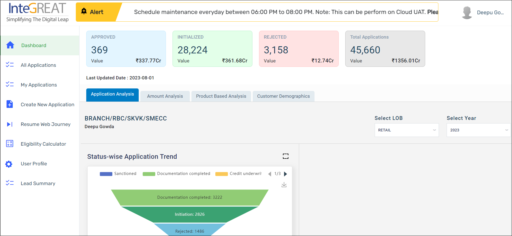

# Introduction

Perfios Software Technologies has automated the onboarding journey for Pensioner Loan applicants to the InteGREAT. The following document serves as a User Manual, illustrating the process of onboarding customers who are looking out for Pensioner Loan from the InteGREAT.

:::info

- It is to be noted that the document serves as reference/user manual for the application. However, there may be Ad Hoc and/or changes in the actual application by virtue of UAT and/or other quick observations. These changes will be accommodated/incorporated in the user manual subsequently.
  :::

## Product Scope

The product that can be availed by a customer for the pensioner loan is listed below.

- Pensioner Loan for an Individual

## Pensioner Loan Application Workflow

1. Branch Officer shall log in to [e-platform](https://boiuserdashboard.sandbox.integreat.perfios.com/#/user/auth/login) as Staff User and will apply for the products as per the customer’s requirement. He/she has the option to apply for a loan of the customer’s choice for credit.

2. The Branch Officer selects Pensioner Loan under Retail and fills the loan application form by providing all the mandatory details.

3. Once the application is triggered, the Application Reference Number is generated on the e-Platform. The following verification checks will be started for the applicant: customer demographic details, credit bureau check, supporting documents, employment details, application details and verification of net worth.
   <!-- [text](ms-appid:undefined) -->
4. The applicant can save the Application Reference ID for future reference. Applicant’s bank statements are used for calculating the assessment.

5. The applicant’s documents are used to assess the application and the required notes are generated.

6. Based on the verification of the applicants’ documents, the Branch Manager can approve, reject, or raise discrepancies against the loan application.

7. If the application is approved, the loan will be disbursed to the applicant.

## Pensioner Loan Journey

### Login

#### Branch Officer / Maker:

1. Login to the [e-platform](https://boiuserdashboard.sandbox.integreat.perfios.com/#/user/auth/login). Select Staff in the Account Type. Enter your **Email ID** and **Password** and click Login. After a successful login, the branch officer/maker will be redirected to the Dashboard page.

   

2. Dashboard
   Once you login, you can view the dashboard. The dashboard consists of:

   - **Approved** - The total number of applications approved by the branch manager.
   - **Initialized** - The total number of applications are puched.
   - **Rejected** - The total number of applications rejected by the branch manager.
   - **Total Application** - The total number of applications submitted by the branch officer.

   It also consists of different charts, namely **Application Analysis, Amoutn Analysis, Product Based Analysis** and **Customer Demographics**.

   

3. My Applications

   Once you land on the **My Applications**, you can view the following web page. By a click on respective tabs, the system will filter and display the applications that are in the respective status.

   - **Draft** - All the draft applications that are still in progress are displayed here. For drafts, you can resume the application from the stage processed earlier.
   - **In-Progress** - All the applications that are in process are displayed here.
   - **Discrepancy** - All the applications displayed here are those which the branch manager / checker finds some parameters or information missing due to which the applications are assigned back to the maker / branch officer.
   - **Completed** - All the applications that are completed by the branch manager / checker are displayed here.
   - **Rejected** - All the applications that are rejected by the maker and/or checker are displayed here.
   - **Recommendation Applications** - The total number of applications that are recommended.

4. All Application

   

   <!-- </img> -->

   <!-- </img> -->
