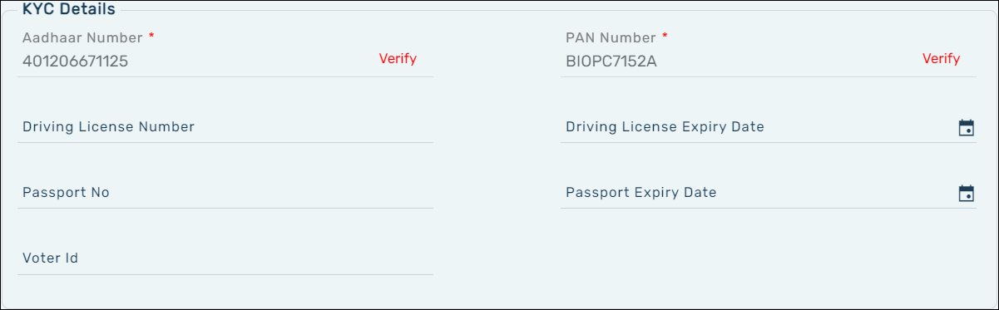
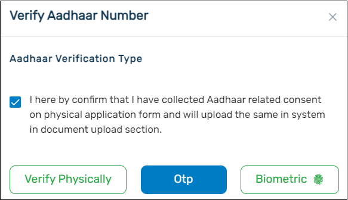
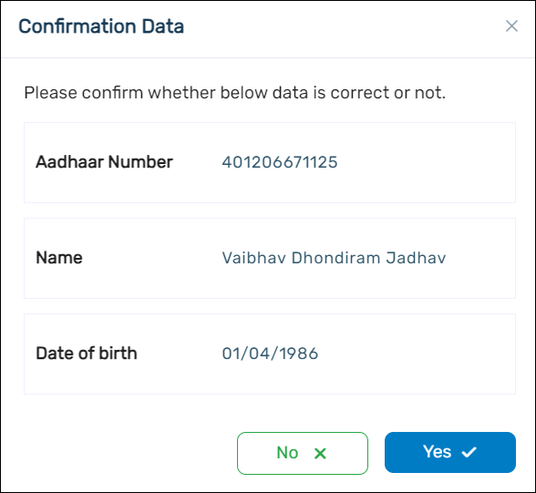
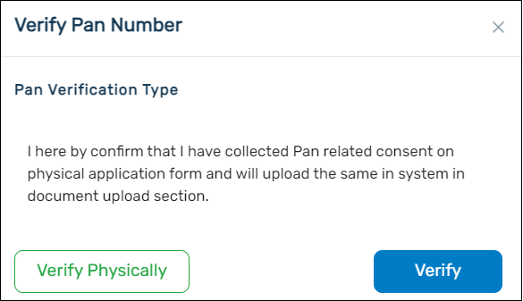
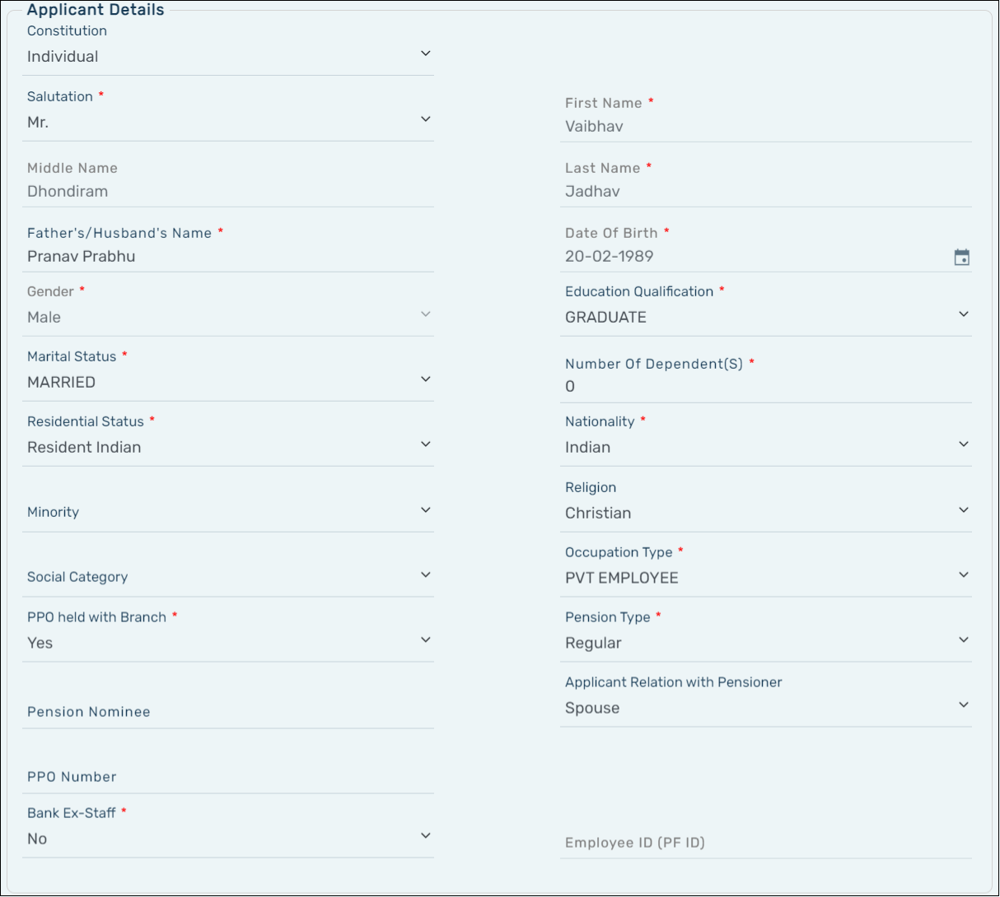
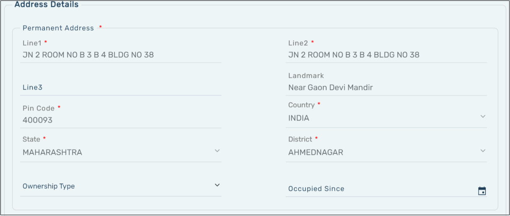
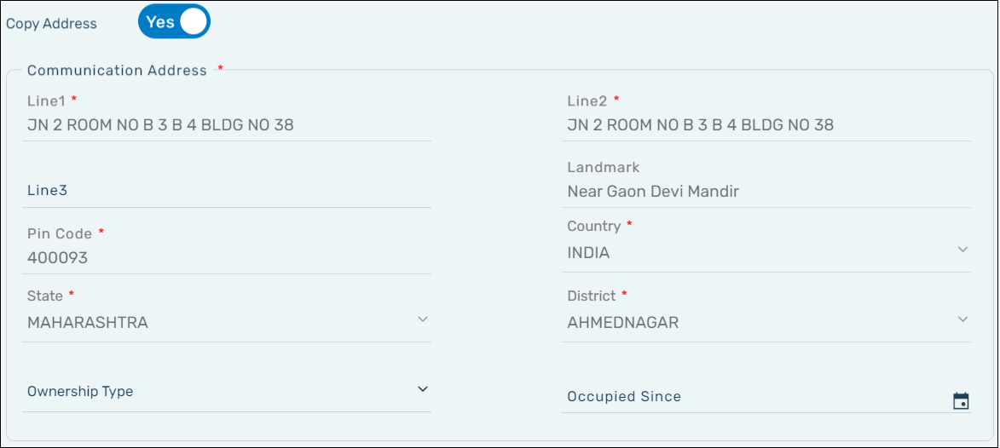
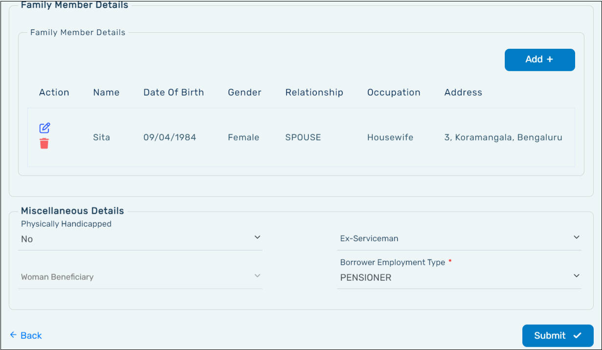

1. KYC Details
   The details will be auto populated using the data available with the bank previously. You can verify the **Aadhaar Number** and **PAN Number**.
   After you make sure all the details (KYC Details, Applicant Details, Address Details, Family Member Details and Miscellaneous Details) are filled, click on the **Submit**.

   

   The Aadhaar Number verification: Click **Verify** next to the Aadhaar Number.

   

   Verify the Aadhaar Number using one of the following methods:

   :::info

   - To verify an **Aadhaar Number** based on OTP, select **OTP**. The applicant will receive the OTP on their registered mobile number triggered by UIDAI. Enter the OTP in the Verification Code field, and then click Verify OTP. A verification pop-up will appear if the OTP is correctly entered.
   - To verify the **Aadhaar Number** based on **biometrics**, select **Biometric**, place the applicant’s thumb over the biometric scanner, and then click Capture.
   - If you choose to verify the Aadhaar Number of the applicant personally, select Verify Physically.
     :::
     You can confirm the details fetched through the **Aadhaar Number** with the name and the date of birth. Click the **Yes** if the details in the pop-up are satisfactory. If you choose to click the **No**, you will be able to enter the **Aadhaar Number** in the application again.

   

   Click **Submit**. As per CBS, make sure there are no special characters in the applicant’s address except space.

   PAN Number Verification: Click \*\*\*\* next to the PAN Number.

   

   Verify the **PAN Number** using one of the following methods:

   :::info

   - To verify a **PAN Number** based on OTP, select Verify. The applicant will receive the OTP on their registered mobile number triggered by NSDL. Enter the OTP in the Verification Code field, and then click Verify OTP. A verification pop-up will appear if the OTP is correctly entered.
   - If you choose to verify the **PAN Number** of the applicant personally, select Verify Physically.
     :::

   **Note**:

   :::info

   - Make sure you fill all the mandatory fields that are marked with a red asterisk (\*).
   - The **Permanent Address** of the applicant will be automatically populated if the Aadhaar verification is done using OTP or Biometrics.
   - For the verification of the **PAN Number**, follow the same steps as described for the Aadhaar Number for the confirmation data pop-up.
   - The details will be automatically entered in the KYC Proof number field, if the KYC Proof type is Aadhaar Card or PAN Card.
   - PAN verification is mandatory.
   - As the expiry date field is not mandatory for all documents, it will be enabled based on the type of document selected as KYC Proof Type.
   - For example, if you select Driving License as KYC Proof, the respective Expiry Date field will have to be filled. For documents having an expiry date, it will be mandatory for you to enter the correct date to proceed with the application.
   - The gender of the applicant will be automatically populated based on the salutation selected in the Applicant Details section.
   - The following fields will be populated by default:

     - First Name
     - Middle Name
     - Last Name
     - Date of Birth

   - The Address of the applicant will be automatically populated if the Aadhaar verification is done using OTP or Biometrics.

   :::

2. Applicant Details:

   
   :::info

   - Make sure that you fill all fields that are marked with a red asterisk (\*).

   :::

3. Address Details:  
   Add the details of the **Permanent Address** of the applicant.

   

   :::info

   - Make sure that you fill all fields that are marked with a red asterisk (\*).
   - Select the ownership type from the drop-down list.
   - Make sure that you fill all fields that are marked with a red asterisk (\*).

   :::

4. Copy Address:  
   If the **Communication Address** of the applicant is same as the **Permanent Address**, click the button next to Copy Address. This will auto-populate the Communication Address if the Permanent Address is filled.

   

5. Add the **Family Member Details** and **Miscellaneous Details** and click Submit button to save the Primary Applicant Details.

   
