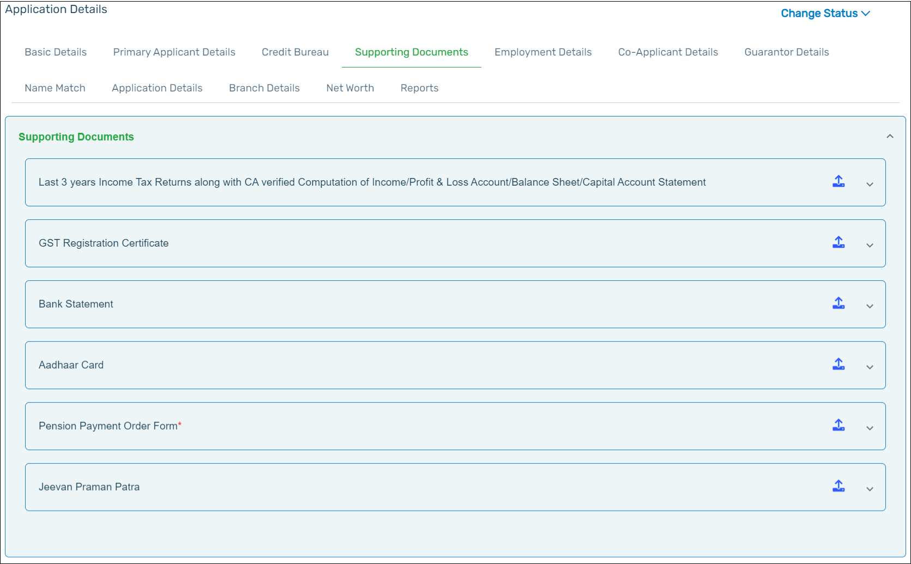
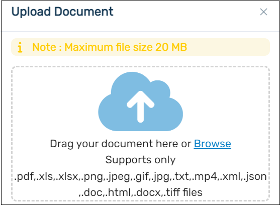
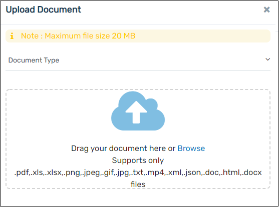
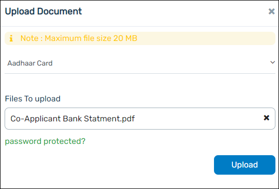
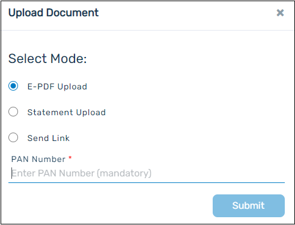
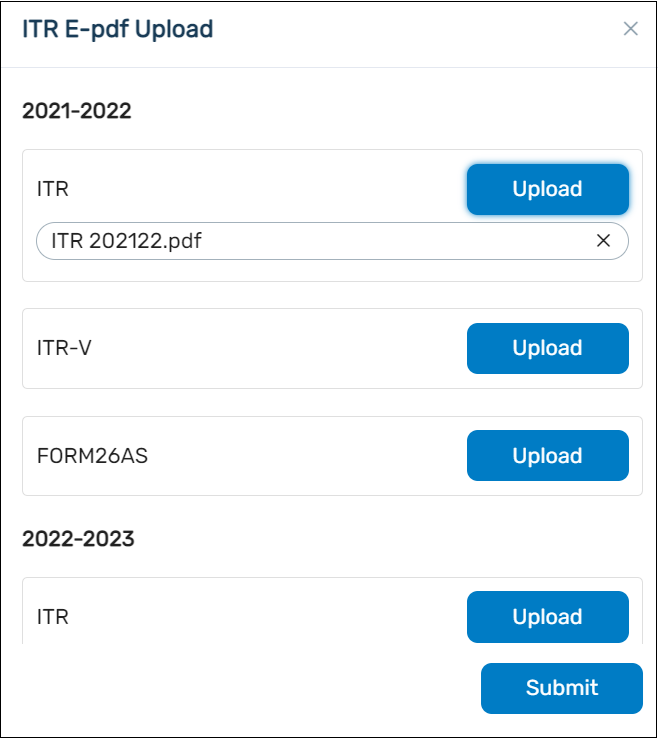
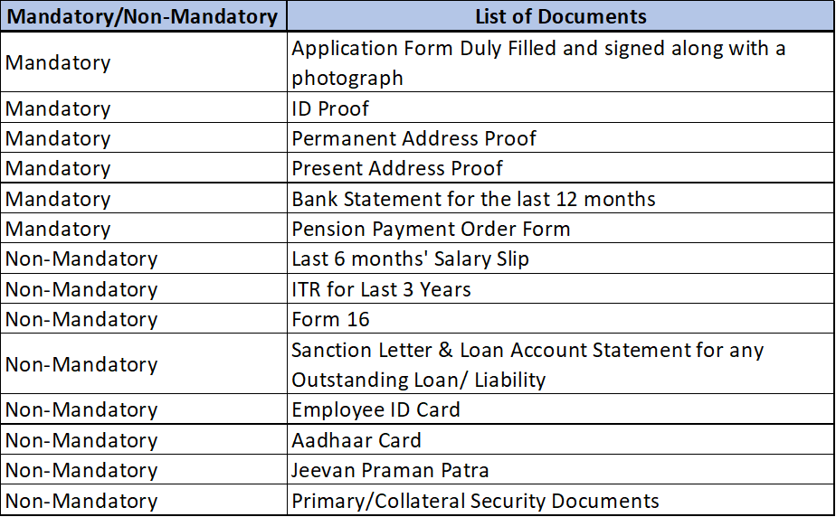
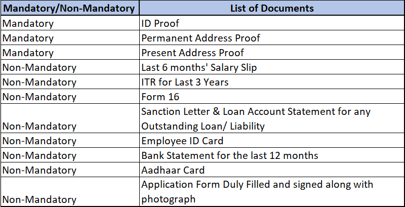
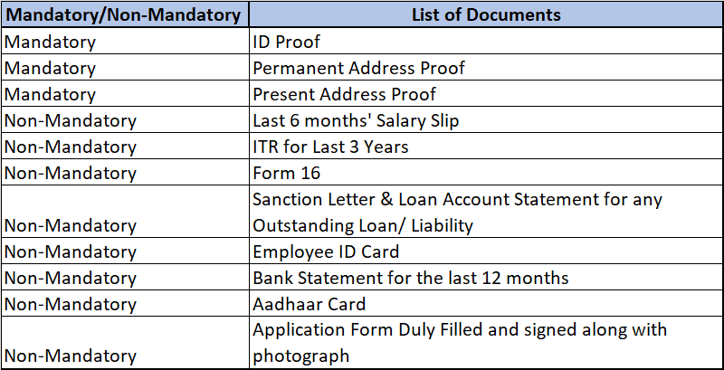

1.  You can upload all the documents that are required for verification purposes. To upload the documents, click upload icon that is present in the same row. The **Aadhaar Card** document will be automatically generated, along with the PDF, text file, and photograph of the applicant, if the e-KYC verification is done by the Branch Officer.

    

    :::info

    - Make sure that you attach all the documents that are marked with a red asterisk (\*) as these are mandatory to process the application.
      :::

2.  Application Form Duly Filled and signed along with photograph To upload the documents, click **Browse or drag** the document.

    

    :::info

    - Only the following file types are supported: **.pdf, .xls, .xlsx, .png, .jpeg, .gif, .jpg, .txt, .mp4, .xml, .json.doc, .html, and .docx.** Click Upload to upload the selected file to the application.
    - You are allowed to upload multiple bank statements and the maximum size of each document is **20 MB**.
    - Follow the process mentioned for Application Form duly filled and signed along with photograph to upload all the documents.
    - If the user wants to password-protect the document, select Password Protected and enter the password before clicking Upload to upload the file.
      :::

3.  Select the document and click Submit to upload the document.

            ### ID Proof

                 Click on ID proof tab, select the Document Type and click Browse or drag the document to upload the document.

                

            :::info
              - Only the following file types are supported: .pdf, .xls, .xlsx, .png, .jpeg, .gif, .jpg, .txt, .mp4, .xml, .json.doc, .html, and .docx. Click Upload to upload the selected file to the application.
              - You are allowed to upload multiple bank statements and the maximum size of each document is **20MB**.
              - Follow the process mentioned for ID proof to upload the **Permanent Address Proof** and **Present Address Proof**.
              - If the user wants to password-protect the document, select Password Protected and enter the password before clicking Upload to upload the file.
              - Select the document and click **Submit** to upload the document.
             :::
            

            ### ITR Upload
                To upload the document, select **E-PDF Upload**.

               To upload the **E-PDF** format files, select the E-PDF option from the list and enter the PAN Number then click **Submit** button.

               

               You can upload the **ITR/ITR-V/FORM26AS E-PDF**. Click Upload next to the document that you are uploading.

               After the document is uploaded, click **Submit**.

               

               :::info
              - Follow the process mentioned for ITR Upload to upload the Bank Statement for the last 6 months.
             :::

    The below mentioned table helps to understand the documents that are mandatory to be uploaded to the :

    ### Documents that are mandatory/optional

        For the list of the documents that are mandatory to be uploaded for the main applicant, please refer to the table below.

        

        For the list of the documents that are mandatory to be uploaded for the **Co-applicant**, please refer to the table below if applicable.

        

        For the list of the documents that are mandatory to be uploaded for the **Guarantors**, please refer to the table below if applicable.

         
